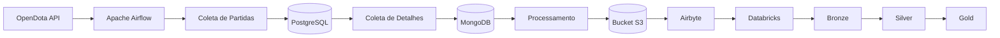
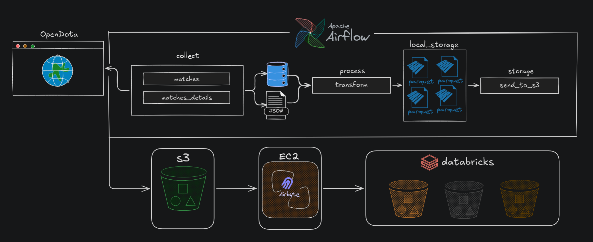

# Pipeline de Dados Dota 2

Este projeto é a implementação de um pipeline de dados completo para coleta, processamento e armazenamento de dados de partidas profissionais de Dota 2 utilizando a API do OpenDota.

## Visão Geral

O pipeline coleta dados brutos da API do OpenDota, armazena as partidas profissionais num PostreSQL, após isso se utiliza dos id's para buscar os detalhes destas e, à partir disso, enviar apenas detalhes apenas das partidas profissionais ao MongoDB, processa estes dados e os envia para o Amazon S3 para consumo no Databricks através da replicação feita pelo Airbyte.

## Fluxo de Dados



---


## Principais Tecnologias
- Python
- Apache Airflow
- PostgreSQL
- MongoDB
- Amazon S3
- Airbyte
- Databricks
- Delta Lake
- PySpark
- Docker
- Docker Compose
- OpenDota API

---

## Componentes

| Componente | Responsabilidade |
|------------|------------------|
| Airflow | Orquestração do pipeline |
| PostgreSQL | Controle das partidas coletadas num banco transacional |
| MongoDB | Persistência temporária dos documentos |
| Amazon S3 | Data Lake |
| Airbyte | Replicação para o Databricks |
| Databricks | Processamento analítico |

---

## Arquitetura do Pipeline



## 1. Coleta de Partidas

Coleta IDs de partidas profissionais da API do OpenDota e armazena no PostgreSQL.

| Flag | Descrição |
|-------|-----------|
| `from_history` | Realiza coleta histórica das partidas |
| `target_date` | Data limite das partidas por coleta histórica |

### Funcionalidades:
- Coleta das partidas em tempo real e históricas
- Evita duplicatas através de verificação no banco
- Suporta coleta retroativa por data (histórica)

## 2. Coleta dos Detalhes das Partidas

Coleta dados detalhados de cada partida identificada na etapa anterior.

### Justificativa do MongoDB:
- **Flexibilidade de Schema**: Dados dos detalhes das partidas não seguem uma estrutura padronizada, com diversos campos altamente aninhados, o que torna muito complexo armazenar num banco transacional, seja por mapeamento ou mesmo armazenando como JSONB
- **Volume**: Alto volume de dados semi-estruturados
- **Performance**: Leitura/escrita rápida para dados não-relacionais
- **Intermediário**: Permite tratamento mínimo antes do armazenamento e envio para o S3

### Processo:
1. Consulta partidas marcadas como não coletadas no PostgreSQL
2. Faz requisições à API do OpenDota
3. Armazena o documento bruto no MongoDB
4. Marca as partidas como coletadas

## 3. Processamento Mínimo

Ajuste de alguns campos como radiant_team_id e dire_team_id para que não extrapole o limite do BSON (formato usado pelo Mongo).

### Estrutura de Saída:
  - #### Arquivos em diretórios locais:

- `match_details`: Dados gerais da partida (1 linha por partida)
- `match_player_details`: Dados detalhados por jogador (~10k linhas por partida)

### Formato:
- Arquivos Parquet para melhor compressão e performance
- Tipos de dados otimizados
- Estrutura pronta para análise

## 4. Envio para S3

Exporta dados processados para o S3, enviados em batches.

### Características:
- Upload em batches de 10.000 arquivos (configurável)
- Estrutura de diretórios por tipo de dado
- Nomeados com timestamp dos arquivos afim de evitar duplicidade
- Remoção local após upload ser feito

### Destino:
- Bucket: `datalake-raw`
- Estrutura:
  ```text
  datalake-raw/
  └── dota2/
      ├── match_details/
      └── match_player_details/
  ```


## 5. Replicação via Airbyte

Airbyte replica automaticamente os dados do Amazon S3 para o Databricks.

### Configuração:
- **Origem**: Amazon S3
- **Destino**: Databricks
- **Frequência**: Em tempo real (Streaming Tables)

## Arquitetura Medalhão no Databricks

Implementação da arquitetura em camadas no Databricks:

### Camadas:
1. **Bronze**: Dados brutos do S3
2. **Silver**: Dados limpos e validados
3. **Gold**: Dados agregados e com estatísticas prontos para consumo

### Tecnologias:
- **Lake Flow**: Orquestração de movimentação entre camadas
- **Streaming Tables**: Processamento em tempo real
- **Delta Lake**: Formato de armazenamento otimizado

## Estrutura do Projeto

```text
.
├── assets/
├── dags/
├── src/
├── tests/
├── .dockerignore
├── docker-compose.yml
├── Dockerfile
├── pyproject.toml
└── README.md
```


## Como Executar

### Pré-requisitos:
- Python 3.12+
- UV
- Astro CLI
- Docker e Docker Compose
- Conta AWS com permissões S3

### Setup:
```bash
# 1. Baixar imagens e iniciar containers
docker-compose up -d

# 2. Instalar/Sincrozinar dependências
uv sync

# 3. Configurar variáveis de ambiente
cp .env-example .env
# Editar .env com suas credenciais

# 4. Instalar astro cli
## linux
curl -sSL install.astronomer.io | sudo bash -s
## windows
wsl --update
wsl --install --no-distribution
winget install -e --id Astronomer.Astro
# 5. Iniciar e rodar Airflow
astro dev init
astro dev start
```

### DAG do Airflow:
- **Nome**: `pipeline_dota2`
- **Schedule**: Diariamente às 02:00 UTC
- **Tasks**:
  1. `collect_matches`
  2. `collect_matches_details`
  3. `process_transform`
  4. `send_to_s3`


## Licença
Este projeto está licenciado sob a licença MIT. Consulte o arquivo `LICENSE` para mais informações.