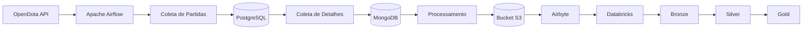
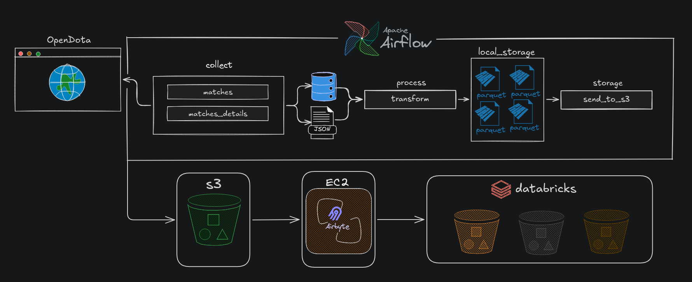

# Pipeline de Dados Dota 2

Este projeto é a implementação de um pipeline de dados completo para coleta, processamento e armazenamento de dados de partidas profissionais de Dota 2 utilizando a API do OpenDota.

## Visão Geral

Pipeline completo de engenharia de dados para coleta, processamento e análise de partidas profissionais de Dota 2, da API do OpenDota até tabelas analíticas com rigor estatístico no Databricks.

O pipeline coleta id's de partidas profissionais da API do OpenDota e os registra num PostgreSQL transacional para controle de estado. À partir dos id's dessas partidas, busca os detalhes completos das partidas e dos players (apenas as profissionais) documentos JSON extensos e altamente aninhados que são persistidos da forma que chegam no MongoDB. Esses documentos passam por um processamento mínimo, são exportados em Parquet para um bucket S3 e replicados pelo Airbyte para o Databricks, onde seguem a arquitetura medalhão (Bronze → Silver → Gold) com processamento incremental.

## Decisões Arquiteturais

| Decisão | Alternativa considerada | Justificativa |
|---------|------------------------|---------------|
| MongoDB para partidas brutas | JSONB no PostgreSQL | Documentos com dezenas de campos aninhados e semi estruturados, dificultando a modelagem relacional o que a tornaria frágil e de manutenção complexa. |
| PostgreSQL transacional | Apenas MongoDB | Controle de estado e idempotência da coleta (quais partidas já foram processadas), evitando reprocessamento e dados duplicados. |
| Airbyte (S3 → Databricks) | Auto Loader direto | Streaming tables gerenciadas e abstração da ingestão, aproveitando a detecção de novos arquivos pelo cursor e o suporte a deduplicação por chave primária diretamente no destino. |
| Parquet no S3 | JSON/CSV | Compressão colunar, schema embutido e leitura otimizada pelo Spark. |
| Processamento incremental com checkpoints | Full reload | Apenas o batch novo é processado na Silver, reduzindo custo computacional e tempo de execução. |
| Wilson score nos rankings | Winrate bruto | Intervalo de confiança inferior com penalização de amostras muito pequenas, não favorecendo times com poucas partidas.|
| Mínimos de amostra (`MIN_GAMES=10`, `MIN_PICKS=20`) | Sem threshold | Filtra ruído estatístico das análises de meta e rankings. |


## Fluxo de Dados


```mermaid
graph LR
    A[OpenDota API] --> B[Apache Airflow] 
    B --> C[Coleta de Partidas] 
    C --> D[(PostgreSQL)] 
    D --> E[Coleta de Detalhes] 
    E --> F[(MongoDB)] 
    F --> G[Processamento] 
    G --> H[(Bucket S3)] 
    H --> I[Airbyte] 
    I --> J[Databricks] 
    J --> K[Bronze] 
    K --> L[Silver]
    L --> M[Gold]
```

---


## Principais Tecnologias


---

## Componentes

| Componente | Responsabilidade |
|------------|------------------|
| Airflow | Orquestração do pipeline |
| PostgreSQL | Controle das partidas coletadas num banco transacional |
| MongoDB | Persistência temporária dos documentos |
| Amazon S3 | Data Lake |
| Airbyte | Replicação para o Databricks |
| Databricks | Processamento analítico |

---

## Arquitetura do Pipeline



## 1. Coleta de Partidas

Coleta IDs de partidas profissionais da API do OpenDota e armazena no PostgreSQL.

| Flag | Descrição |
|-------|-----------|
| `from_history` | Realiza coleta histórica das partidas |
| `target_date` | Data limite das partidas por coleta histórica |

### Funcionalidades:
- Coleta das partidas em tempo real e históricas
- Evita duplicatas através de verificação no banco
- Suporta coleta retroativa por data (histórica)

## 2. Coleta dos Detalhes das Partidas

Coleta dados detalhados de cada partida identificada na etapa anterior.

### Justificativa do MongoDB:
- **Flexibilidade de Schema**: Dados dos detalhes das partidas não seguem uma estrutura padronizada, com diversos campos altamente aninhados, o que torna muito complexo armazenar num banco transacional, seja por mapeamento ou mesmo armazenando como JSONB
- **Volume**: Alto volume de dados semi-estruturados
- **Performance**: Leitura/escrita rápida para dados não-relacionais
- **Intermediário**: Permite tratamento mínimo antes do armazenamento e envio para o S3

### Processo:
1. Consulta partidas marcadas como não coletadas no PostgreSQL
2. Faz requisições à API do OpenDota
3. Armazena o documento bruto no MongoDB
4. Marca as partidas como coletadas

## 3. Processamento Mínimo

Ajuste de alguns campos como radiant_team_id e dire_team_id para que não extrapole o limite do BSON (formato usado pelo Mongo).

### Estrutura de Saída:
  - #### Arquivos em diretórios locais:

- `match_details`: Dados gerais da partida (1 linha por partida)
- `match_player_details`: Dados detalhados por jogador (~10k linhas por partida)

### Formato:
- Arquivos Parquet para melhor compressão e performance
- Tipos de dados otimizados
- Estrutura pronta para análise

## 4. Envio para S3

Exporta dados processados para o S3, enviados em batches.

### Características:
- Upload em batches de 10.000 arquivos (configurável)
- Estrutura de diretórios por tipo de dado
- Nomeados com timestamp dos arquivos afim de evitar duplicidade
- Remoção local após upload ser feito

### Destino:
- Bucket: `datalake-raw`
- Estrutura:
  ```text
  datalake-raw/
  └── dota2/
      ├── match_details/
      └── match_player_details/
  ```


## 5. Replicação via Airbyte

Airbyte replica automaticamente os dados do Amazon S3 para o Databricks.

### Configuração:
- **Origem**: Amazon S3
- **Destino**: Databricks
- **Frequência**: Em tempo real (Streaming Tables)

## Arquitetura Medalhão no Databricks

Implementação da arquitetura em camadas no Databricks:

### Camadas:
1. **Bronze**: Dados brutos do S3
2. **Silver**: Dados limpos e validados
3. **Gold**: Dados agregados e com estatísticas prontos para consumo

### Tecnologias:
- **Lake Flow**: Orquestração de movimentação entre camadas
- **Streaming Tables**: Processamento em tempo real
- **Delta Lake**: Formato de armazenamento otimizado

## Estrutura do Projeto

```text
.
├── assets/
├── dags/
├── src/
├── tests/
├── .dockerignore
├── docker-compose.yml
├── Dockerfile
├── pyproject.toml
└── README.md
```


## Como Executar

### Pré-requisitos:
- Python 3.12+
- UV
- Astro CLI
- Docker e Docker Compose
- Conta AWS com permissões S3

### Setup:
```bash
# 1. Baixar imagens e iniciar containers
docker-compose up -d

# 2. Instalar/Sincrozinar dependências
uv sync

# 3. Configurar variáveis de ambiente
cp .env-example .env
# Editar .env com suas credenciais

# 4. Instalar astro cli
## linux
curl -sSL install.astronomer.io | sudo bash -s
## windows
wsl --update
wsl --install --no-distribution
winget install -e --id Astronomer.Astro
# 5. Iniciar e rodar Airflow
astro dev init
astro dev start
```

### DAG do Airflow:
- **Nome**: `pipeline_dota2`
- **Schedule**: Diariamente às 02:00 UTC
- **Tasks**:
  1. `collect_matches`
  2. `collect_matches_details`
  3. `process_transform`
  4. `send_to_s3`


## Licença
Este projeto está licenciado sob a licença MIT. Consulte o arquivo `LICENSE` para mais informações.
